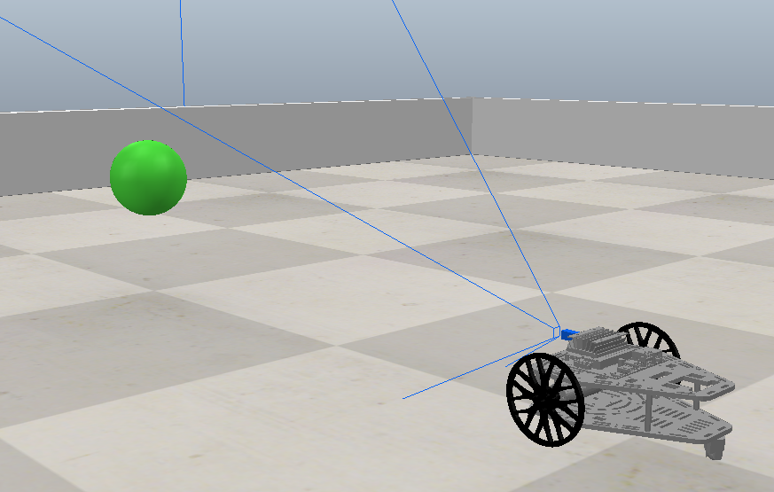
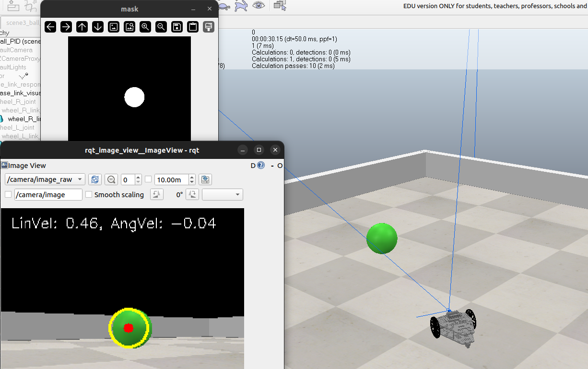

# PuzzleBot With CoppeliaSim

<p align="center">
  
  
</p>

ROS package for simulating the PuzzleBot mobile robot within the CoppeliaSim (formerly V-REP) environment. This package provides the necessary nodes, launch files, and configuration to interface ROS with a CoppeliaSim scene containing the PuzzleBot model.

## Table of Contents

* [Prerequisites](#prerequisites)
* [Installation](#installation)
* [Usage](#usage)

## Prerequisites

Before you begin, ensure you have met the following requirements:

* **Operating System:** Ubuntu 22.04
* **ROS:** ROS2 Humble
* **CoppeliaSim:** CoppeliaSim Edu 

## Installation

Follow these steps to set up the project:

1.  **Clone the Repository:**
    Clone this repository to your local machine. Open a terminal and run:
    ```bash
    git clone https://github.com/JJJau03/puzzlebot_coppeliaSim.git
    ```

2.  **Navigate to Project Directory:**
    Change into the directory created by cloning:
    ```bash
    cd puzzlebot_coppeliaSim
    ```

3.  **Make Setup Script Executable:**
    Give the setup script execution permissions:
    ```bash
    chmod +x setup.sh
    ```

4.  **Run Setup Script:**
    Execute the setup script. This script should handle the installation of necessary dependencies and any required build steps.
    ```bash
    ./setup.sh
    ```

## Usage

1.  **Start CoppeliaSim:**
    Launch the CoppeliaSim application.

2.  **Load the Scene:**
    Open the provided CoppeliaSim scene file located in this repository:
    * `File` -> `Open scene...` -> Navigate to `puzzlebot_coppeliaSim/scenes/scene3_ball_PID.ttt>`
    
3.  **Start Simulation in CoppeliaSim:**
    Press the "Start/Resume simulation" button in the CoppeliaSim toolbar. Ensure the ROS interface components within the simulation are active and connecting.

4.  **Control the Robot**

    Choose one of the following methods to control the robot:

    **a) Manual Control:**

    1.  Open a new terminal (ensure your workspace is sourced) and run the specific node for the PuzzleBot in CoppeliaSim:
        ```bash
        ros2 run coppelia_sim_ros2 puzzlebot_coppelia
        ```
        *This node handles the basic simulation setup and communication for manual control.*

    2.  **Start Keyboard Teleoperation:** Open **another** new terminal (workspace sourced) and run the standard keyboard teleoperation node:
        ```bash
        ros2 run teleop_twist_keyboard teleop_twist_keyboard
        ```
        *Follow the instructions printed in this terminal to drive the robot using your keyboard.*

    **b) Automatic Control (Follow the Ball):**

    1.  Open a new terminal and run the main launch file configured for automatic behavior:
        ```bash
        ros2 launch coppelia_sim_ros2 coppelia_bridge.launch.py
        ```
        *This launch file starts all the necessary ROS nodes to communicate with CoppeliaSim and execute the automatic ball-following behavior.*
        
You can watch a demonstration video here: [Demo](https://drive.google.com/file/d/12Yol55EU4ecgvto2wor3YjOedjQ2bYVx/view?usp=sharing)